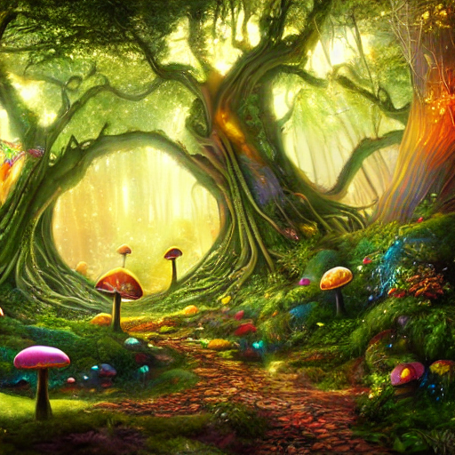
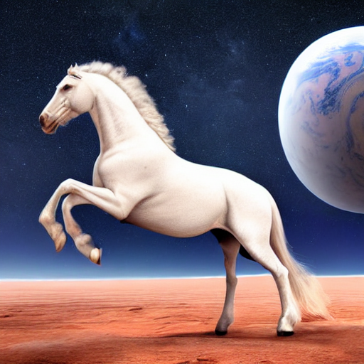
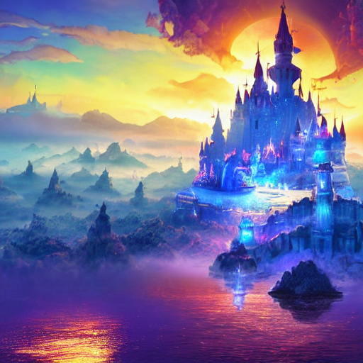

# PRODIGY_GA_02 - Image Generation with Stable Diffusion

## Objective
Generate images from text prompts using a pre-trained generative AI model.

## Model Used
- Stable Diffusion v1.5
- Hugging Face Diffusers
- Google Colab (T4 GPU)

## Technologies Used
- Python
- PyTorch
- Diffusers
- Transformers

## Prompts Used
1. Futuristic Smart City
2. Magical Fantasy Forest
3. Astronaut Riding a Horse on Mars
4. Majestic floating castle

## Output
Successfully generated AI images from descriptive text prompts using the Stable Diffusion v1.5 model.

## 🖼️ Generated Images

## Skills Learned
- Text-to-Image Generation
- Prompt Engineering
- Stable Diffusion Pipeline
- Hugging Face Diffusers
- Google Colab
